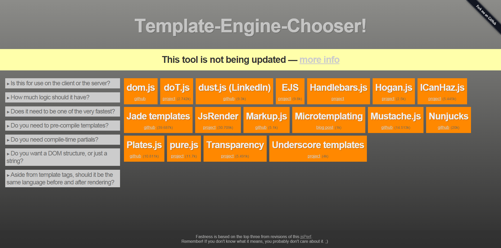

<link href="http://cdn.bootcss.com/highlight.js/8.0/styles/monokai_sublime.min.css" rel="stylesheet">

<!--

-->

# javascript模板引擎之Mustache
***

Mustache是基于JavaScript实现的模版引擎，轻量级，语法更加的简单易用，很容易上手

### 一、 模板简介
模板通常是指嵌入了某种动态编程语言代码的文本，数据和模板通过某种形式的结合，可以变化出不同的结果。  
模板通常用来定义显示的形式，能够使得数据展现更为丰富，而且容易维护。例如，下面是一个模板的例子：

	<ul>
	    <% for(var i in items){ %>
	        <li class='<%= items[i].status %>'><%= items[i].text %></li>
	    <% } %>
	</ul>

如果有如下items数据：

	items:[
	    { text: 'text1' ,status:'done' },
	    { text: 'text2' ,status:'pending' },
	    { text: 'text3' ,status:'pending' },
	    { text: 'text4' ,status:'processing' }
	]	

通过某种方式的结合，可以产生下面的Html代码：

	<ul>
	    <li class='done'>text1<li>
	    <li class='pending'>text2<li>
	    <li class='pending'>text3<li>
	    <li class='processing'>text4<li>
	</ul>

如果不使用模板，想要达到同样的效果，即将上面的数据展现成结果的样子，需要像下面这样做：

	var temp = '<ul>';
	for(var i in items){
	    temp += "<li class='" + items[i].status + "'>" + items[i].text + "</li>";
	}
	temp += '</ul>';

**可以看出使用模板有如下好处：**

- 简化了html的书写
- 通过编程元素（比如循环和条件分支），对数据的展现更具有控制的能力
- 分离了数据与展现，使得展现的逻辑和效果更易维护

### 二、模板引擎

通过分析模板，将数据和模板结合在一起输出最后的结果的程序称为模板引擎。

1. Mustache  
基于javascript 实现的模板引擎,类似于 Microsoft’s jQuery template plugin,但更简单易用!

2. Handlebars   
Handlebars为最流行的模板引擎之一，构建于Mustache之上。

3. [Underscore Templates](http://underscorejs.org/#template)  
“<%= %>”用于输出
<% %>用来包含JavaScript

4. [Jade](http://jade-lang.com/)  
Jade是受Haml的影响以JavaScript实现用于node的高性能模板引擎。

	 // template.jade  
	  p  
	    | Hello,  
	    = name  
  
	 // JS  
	  jade.renderFile("template.jade", { name: "Jack" }, function(err, result) {  
	    console.log(result);  
	    // logs: Hello, Jack  
	  });  

Template-Engine-Chooser: [http://garann.github.io/template-chooser/](http://garann.github.io/template-chooser/)

### 二、JS模板引擎的实现原理

想得到预期html字符串，我们必须设法让模板内部的javascript变量置换、javaScript语句执行，也就是把JavaScript代码剥离出来执行，把其它html语句拼接为一个字符串。
虽然每个引擎从模板语法、语法解析、变量赋值、字符串拼接的实现方式各有所不同，但关键的渲染原理仍然是动态执行 javascript 字符串。

#### 1. 正则进行简单的字符串置换
使用正则表达式寻找里面的模板参数，然后替换成传给引擎的具体数据。

    var TemplateEngine = function(tpl, data) {
        var re = /<%([^%>]+)?%>/g;
        while(match = re.exec(tpl)) {
            tpl = tpl.replace(match[0], data[match[1]])
        }
        return tpl;
    }

如果正则匹配成功，则match不为空，match[0]是匹配到的字符串 <% template %>，match[1]是捕获到的变量template。

#### 2. javascript动态函数
在js中function是字面语法，js的运行时会将字面的function转化成Function对象，所以实际上Function提供了更为底层和灵活的机制。

用 Function 类直接创建函数的语法如下：

    var function_name = new Function(arg1, arg2, ..., argN, function_body);

例如：

    //创建动态函数
    var fn = new Function("arg", "console.log(arg + 1);");  //参数: arg，函数体: console.log(arg + 1);
    //执行
    fn(2); // outputs 3

    function tmpl(id,data){
        var html=document.getElementById(id).innerHTML;
        var result="var p=[];with(obj){p.push('"
            +html.replace(/[\r\n\t]/g," ")
            .replace(/<%=(.*?)%>/g,"');p.push($1);p.push('")
            .replace(/<%/g,"');")
            .replace(/%>/g,"p.push('")
            +"');}return p.join('');";
        var fn=new Function("obj",result);
        return fn(data);
    }

最终代码：

    module.exports = function(html, options) {
        var re = /<%(.+?)%>/g,
            reExp = /(^( )?(var|if|for|else|switch|case|break|{|}|;))(.*)?/g,
            code = 'with(obj) { var r=[];\n',
            cursor = 0,
            result;
        var add = function(line, js) {
            js? (code += line.match(reExp) ? line + '\n' : 'r.push(' + line + ');\n') :
                (code += line != '' ? 'r.push("' + line.replace(/"/g, '\\"') + '");\n' : '');
            return add;
        }
        while(match = re.exec(html)) {
            add(html.slice(cursor, match.index))(match[1], true);
            cursor = match.index + match[0].length;
        }
        add(html.substr(cursor, html.length - cursor));
        code = (code + 'return r.join(""); }').replace(/[\r\t\n]/g, '');
        try { result = new Function('obj', code).apply(options, [options]); }
        catch(err) { console.error("'" + err.message + "'", " in \n\nCode:\n", code, "\n"); }
        return result;
    }

更多资料:
[http://krasimirtsonev.com/blog/article/Javascript-template-engine-in-just-20-line](http://krasimirtsonev.com/blog/article/Javascript-template-engine-in-just-20-line)  

