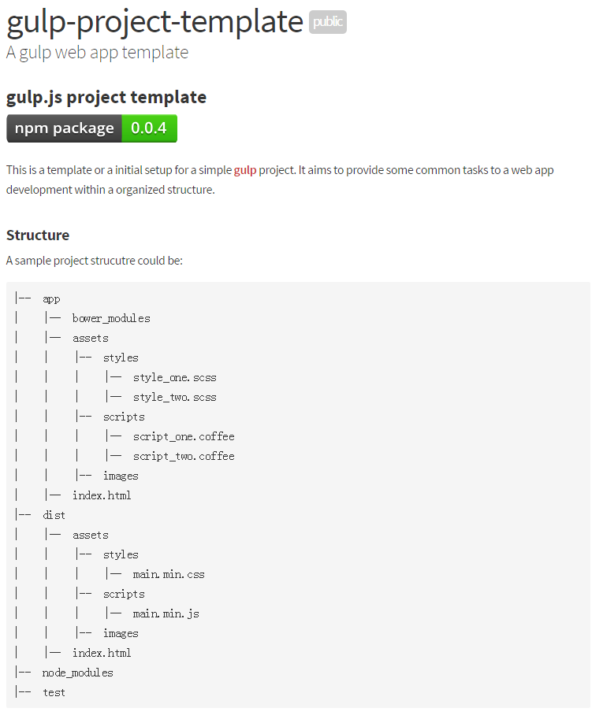

<link href="http://cdn.bootcss.com/highlight.js/8.0/styles/monokai_sublime.min.css" rel="stylesheet">
<script src="http://cdn.bootcss.com/highlight.js/8.0/highlight.min.js"></script>
<script >hljs.initHighlightingOnLoad();</script>


# 基于Gulp的前端自动化
***

优化你的网站项目，在各个浏览器上去测试是开发设计过程中最没趣的过程，它包含了很多重复的任务，我们可以使用正确的工具来提高你的工作效率。
Gulp是一个自动化构建系统，它可以帮助你完成一些常见的自动化任务，比如编译预处理CSS，压缩JS并重新加载浏览器等，从而提高你的开发速率，让你的工作更有效率。


[Gulp官方文档](https://github.com/gulpjs/gulp/tree/master/docs)  
[Gulp中文文档](http://www.gulpjs.com.cn/)  
 


Gulp是一种基于流的，代码优于配置的新一代构建工具。 

> Gulp具有高效性特点，因为它是通过Node.js强大的流，不需要写入临时文件/文件夹到磁盘，因此可以更快的完成构建。 

> Gulp允许你一次输入所有插件，然后把这一堆插件通过管流一次输出出来，比起安装每个插件，然后对每个插件进行输入输出（如Grunt）要快的多。


### 1. 安装

Gulp是基于Node.js的，故要首先安装 Node.js。

全局安装Gulp
```$ npm install --global gulp```   

然后再在项目的根目录下安装Gulp
```$ npm install gulp --save-dev```  


### 2. 安装gulp plugins

在项目中安装你所需要的模块，如：  
```$ npm install gulp-uglify --save-dev```

 

Sass compile  (<a href="https://github.com/sindresorhus/gulp-ruby-sass" target="_blank">gulp-ruby-sass</a>)  
Autoprefixer (<a href="https://github.com/Metrime/gulp-autoprefixer" target="_blank">gulp-autoprefixer</a>)  
Minify CSS (<a href="https://github.com/jonathanepollack/gulp-minify-css" target="_blank">gulp-minify-css</a>)  
JSHint (<a href="https://github.com/wearefractal/gulp-jshint" target="_blank">gulp-jshint</a>)  
Concatenation (<a href="https://github.com/wearefractal/gulp-concat" target="_blank">gulp-concat</a>)  
Uglify (<a href="https://github.com/terinjokes/gulp-uglify" target="_blank">gulp-uglify</a>)  
Compress images (<a href="https://github.com/sindresorhus/gulp-imagemin" target="_blank">gulp-imagemin</a>)  
LiveReload (<a href="https://github.com/vohof/gulp-livereload" target="_blank">gulp-livereload</a>)  
Caching of images so only changed images are compressed (<a href="https://github.com/jgable/gulp-cache/" target="_blank">gulp-cache</a>)  
Notify of changes (<a href="https://github.com/mikaelbr/gulp-notify" target="_blank">gulp-notify</a>)  
Clean files for a clean build (<a href="https://www.npmjs.org/package/del" target="_blank">del</a>)  

可使用以下命令一次安装多个插件
```$ npm install gulp-ruby-sass gulp-autoprefixer gulp-minify-css gulp-jshint gulp-concat gulp-uglify gulp-imagemin gulp-notify gulp-rename gulp-livereload gulp-cache del --save-dev```

更多插件：[Gulp插件列表](http://gulpjs.com/plugins/)


### 3. 在项目根目录下创建 gulpfile.js

**创建 gulpfile.js**

    var gulp = require('gulp'),
       uglify = require('gulp-uglify');

    gulp.task('minify', function () {
       gulp.src('js/app.js')
          .pipe(uglify())
          .pipe(gulp.dest('build'))
    });

    gulp.task('default', ['minify']);


gulpfile.js加载gulp和gulp-uglify模块之后，使用gulp模块的task方法指定任务。
task方法有两个参数，第一个是任务名，第二个是任务函数。在任务函数中，使用gulp模块的src方法，指定所要处理的文件，然后使用pipe方法，将上一步的输出转为当前的输入，进行链式处理。

在上面代码中，使用两次pipe方法，也就是说做了两种处理。第一种处理是使用gulp-uglify模块，压缩源码；第二种处理是使用gulp模块的dest方法，将上一步的输出写入本地文件，这里是build.js（代码中省略了后缀名js）。

从上面的例子中可以看到，gulp充分使用了“管道”思想，就是一个数据流（stream）：src方法读入文件产生数据流，dest方法将数据流写入文件，中间是一些中间步骤，每一步都对数据流进行一些处理。


    var gulp = require('gulp');
    var coffee = require('gulp-coffee');
    var concat = require('gulp-concat');
    var uglify = require('gulp-uglify');
    var imagemin = require('gulp-imagemin');
    var sourcemaps = require('gulp-sourcemaps');
    var del = require('del');
     
    var paths = {
      scripts: ['client/js/**/*.coffee', '!client/external/**/*.coffee'],
      images: 'client/img/**/*'
    };
     
    // Not all tasks need to use streams
    // A gulpfile is just another node program and you can use all packages available on npm
    gulp.task('clean', function(cb) {
      // You can use multiple globbing patterns as you would with `gulp.src`
      del(['build'], cb);
    });
     
    gulp.task('scripts', ['clean'], function() {
      // Minify and copy all JavaScript (except vendor scripts)
      // with sourcemaps all the way down
      return gulp.src(paths.scripts)
        .pipe(sourcemaps.init())
        .pipe(coffee())
        .pipe(uglify())
        .pipe(concat('all.min.js'))
        .pipe(sourcemaps.write())
        .pipe(gulp.dest('build/js'));
    });
     
    // Copy all static images
    gulp.task('images', ['clean'], function() {
      return gulp.src(paths.images)
        // Pass in options to the task
        .pipe(imagemin({optimizationLevel: 5}))
        .pipe(gulp.dest('build/img'));
    });
     
    // Rerun the task when a file changes
    gulp.task('watch', function() {
      gulp.watch(paths.scripts, ['scripts']);
      gulp.watch(paths.images, ['images']);
    });

     
    // The default task (called when you run `gulp` from cli)
    gulp.task('default', ['watch', 'scripts', 'images']);


### 4.  gulp api

* gulp.task(name, fn) - 定义任务，第一个参数是任务名，第二个参数是任务内容。
* gulp.src(path) - 选择文件，传入参数是文件路径。
* gulp.dest(path) - 输出文件
* gulp.pipe() - 管道，你可以暂时将 pipe 理解为将操作加入执行队列

[gulp api](http://www.gulpjs.com.cn/docs/api/)

### 5. Why Gulp?

Glup使用node.js串流(streams)让建构更快速，不须写出资料到硬盘的暂存档案/目录。Gulp利用来源档案当作输入，串流到一群plugins，最后取得输出的结果，并非配置每一个plugin的输入与输出–就像Grunt。 

让我们来看个范例，分别在Gulp及Grunt建构Sass：

Grunt:

	module.exports = function(grunt) {
		grunt.initConfig({
			sass: {  
			  dist: {
			    options: {
			      style: 'expanded'
			    },
			    files: {
			      'dist/assets/css/main.css': 'src/styles/main.scss',
			    }
			  }
			},
			
			autoprefixer: {  
			  dist: {
			    options: {
			      browsers: [
			        'last 2 version', 'safari 5', 'ie 8', 'ie 9', 'opera 12.1', 'ios 6', 'android 4'
			      ]
			    },
			    src: 'dist/assets/css/main.css',
			    dest: 'dist/assets/css/main.css'
			  }
			}
		});

		grunt.loadNpmTasks('grunt-sass');     
        grunt.loadNpmTasks('grunt-autoprefixer');  
		
		grunt.registerTask('styles', ['sass', 'autoprefixer']); 
	};	
 
Grunt需要各别配置plugin，指定其来源与目的路径。例如，我们将一个档案作为外挂Sass的输入，并储存输出结果。在设置Autoprefixer时，需要将Sass的输出结果作为输入，产生出一个新档案。来看看在Gulp中同样的配置：


Gulp:

	gulp.task('sass', function() {  
	  return gulp.src('src/styles/main.scss')
	    .pipe(sass({ style: 'compressed' }))
	    .pipe(autoprefixer('last 2 version', 'safari 5', 'ie 8', 'ie 9', 'opera 12.1', 'ios 6', 'android 4'))
	    .pipe(gulp.dest('dist/assets/css'))
	});

在Gulp中我们只需要输入一个档案即可。经过外挂Sass处理，再传到外挂Autoprefixer，最终取得一个档案。这样的流程加快建构过程，省去读取及写出不必要的档案，只需要最终的一个档案。


### 4.  gulp-project-template



更多资料：  
1. [http://markgoodyear.com/2014/01/getting-started-with-gulp/](http://markgoodyear.com/2014/01/getting-started-with-gulp/)  
2. [http://www.smashingmagazine.com/2014/06/11/building-with-gulp/](http://www.smashingmagazine.com/2014/06/11/building-with-gulp/)  
3. [http://javascript.ruanyifeng.com/tool/gulp.html](http://javascript.ruanyifeng.com/tool/gulp.html)  
4. [http://www.techug.com/gulp](http://www.techug.com/gulp)  

