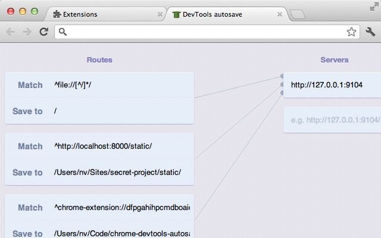

<link href="http://cdn.bootcss.com/highlight.js/8.0/styles/monokai_sublime.min.css" rel="stylesheet">
<script src="http://cdn.bootcss.com/highlight.js/8.0/highlight.min.js"></script>
<script >hljs.initHighlightingOnLoad();</script> 

<!--
http://addyosmani.com/blog/autosave-changes-chrome-dev-tools/
-->

# 使用Autosave在Chrome调试工具上自动保存修改到本地的css和js文件中
- - - 

[Chrome DevTools Autosave](https://github.com/NV/chrome-devtools-autosave)


使用AutoSave拓展程序可以将你在Chrome Developer Tools的修改点立即同步到你相应的本地css和js文件中，这意味着你将不需要在文本编辑器和浏览器之间不断地做来回切换，大大节省开发时间。


### 一、安装
#### 1. Installing the Extension
 * 在谷歌浏览器中输入 **chrome://flags/**，然后找到实验性扩展程序API ，点击开启后。

 * 重启浏览器
 * 下载安装[AutoSave](http://userscripts.ru/js/chrome-devtools-autosave/latest.crx)拓展程序  


#### 2. Installing the Server
AutoSave需要使用node服务器保存文件。

 * 安装[Node.js](https://nodejs.org/)
 * 在终端上执行命令 ```npm install -g autosave```


### 二、使用
运行```$ autosave```


AutoSave默认是调试以file://路径开头的页面，如果想要调试 http://localhost/ 或 http://10.1.204.74:9898 这样的地址，只要在AutoSave拓展配置添加你要配置的页面路径地址，如下图：  



