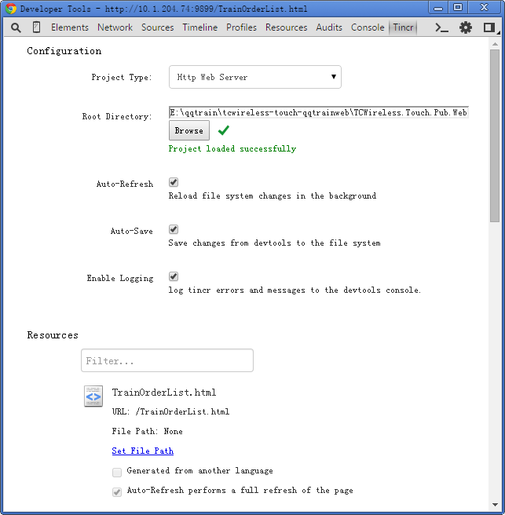
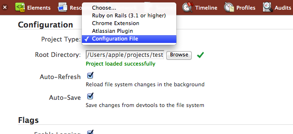

<link href="http://cdn.bootcss.com/highlight.js/8.0/styles/monokai_sublime.min.css" rel="stylesheet">

 

<!--
http://addyosmani.com/blog/lets-tincr-bi-directional-editing-and-saving-with-the-chrome-devtools/

http://tin.cr/docs.html
-->

# Tincr——在Chrome DevTools双向编辑的保存
- - -  

我们常常发现我们自己在调试代码时经常需要在Chrome开发工具和文本编辑器之间进行来回切换， 这耗费了我们很多不必要的时间。   
[Tincr](http://tin.cr/)都可以帮助我们解决这个问题。

### 1. Tincr是什么?
Tince的两大作用：

 - 在Chrome开发工具上的改变（css或js）立即同步到源文件中。 例如，我们常常使用“审查元素”的这个功能，然后尝试修改元素的样式，调试好后，又要将调试好的样式复制粘贴到编辑器中。
 - 在源文件中代码修改css或js后，浏览器会自动重新加载并展现新的页面效果。

Tincr Demo Video: [https://www.youtube.com/watch?v=d30unX8Xv_8](https://www.youtube.com/watch?v=d30unX8Xv_8) 个人觉得比Autosave更强大，更好用

### 2. 安装
安装地址：[https://chrome.google.com/webstore/detail/tincr/lfjbhpnjiajjgnjganiaggebdhhpnbih](https://chrome.google.com/webstore/detail/tincr/lfjbhpnjiajjgnjganiaggebdhhpnbih)

### 3. 配置
安装成功后Tincr会在Chrome开发工具上添加一个新的tab。 

Tincr支持4应用程序类型 (Ruby on Rails, Chrome Extension, Atlassian Plugin, Configuration file)

如果你是一个Ruby开发人员和调试应用程序的DevTools

配置Tincr,遵循这些步骤 
